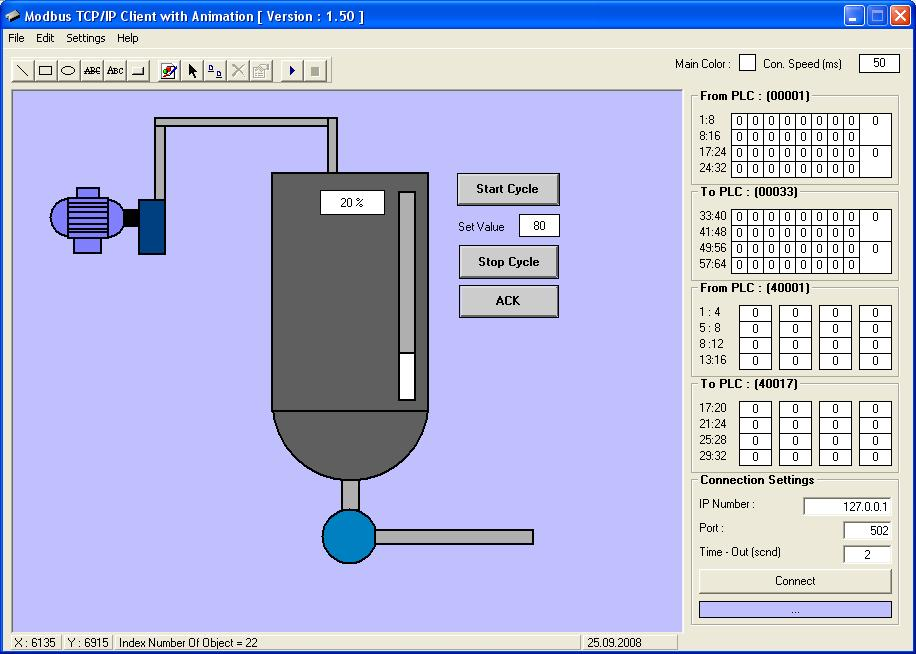



## Modbus TCP/IP Animation

### Description

here is the very simple but good example for the Modbus Plus TCP/IP connection and animation drawing system..Complately all in one pack.. create your PLC Program on your PLC Programmin tool, Draw your mechine as simple on this program, write simple VBScript codes then connect your TCP Modbus connection to your PLC or PLCSim32 then orient Objects.....
 
### More Info
 

             |
---                |---
**Submitted On**   |2007-02-18 03:20:44
**By**             |[Oktay AVCI](https://github.com/Planet-Source-Code/PSCIndex/blob/master/ByAuthor/oktay-avci.md)
**Level**          |Advanced
**User Rating**    |4.8 (29 globes from 6 users)
**Compatibility**  |VB 6\.0
**Category**       |[Object Oriented Programming \(OOP\)](https://github.com/Planet-Source-Code/PSCIndex/blob/master/ByCategory/object-oriented-programming-oop__1-47.md)
**World**          |[Visual Basic](https://github.com/Planet-Source-Code/PSCIndex/blob/master/ByWorld/visual-basic.md)
**Archive File**   |[Modbus\_TCP2048482172007\.zip](https://github.com/Planet-Source-Code/oktay-avci-modbus-tcp-ip-animation__1-67898/archive/master.zip)

